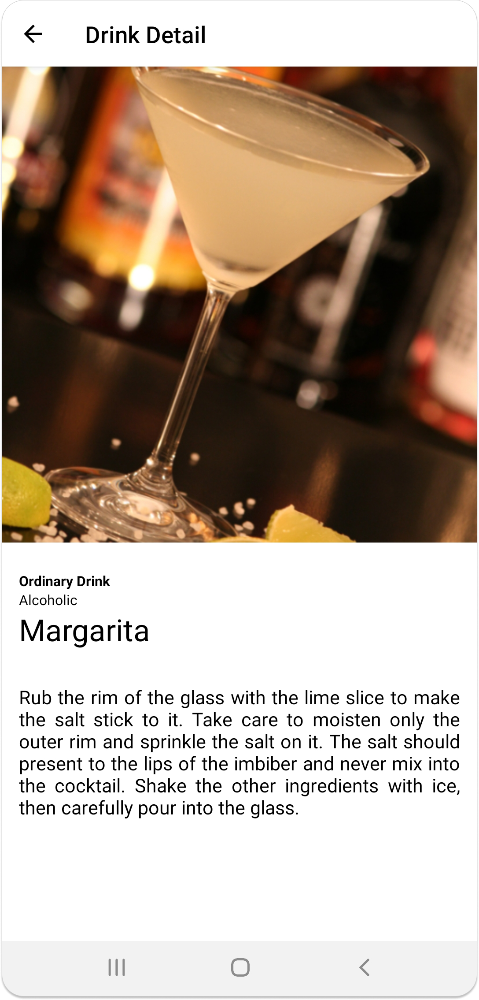
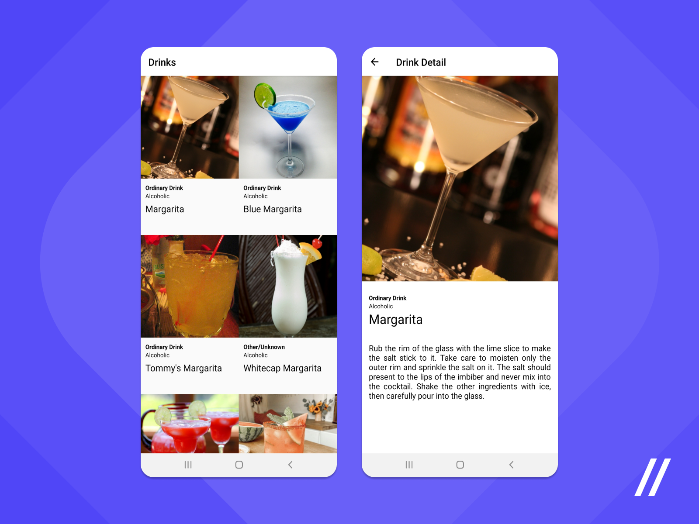

# Android Recyclerview with MVVM Sample

A simple demo project based on Recyclerview with MVVM clean architecture.

Including:
 * ViewModel
 * LiveData
 * Hilt (for dependency injection)
 * Kotlin Coroutines
 * Retrofit
 * Navigation
 